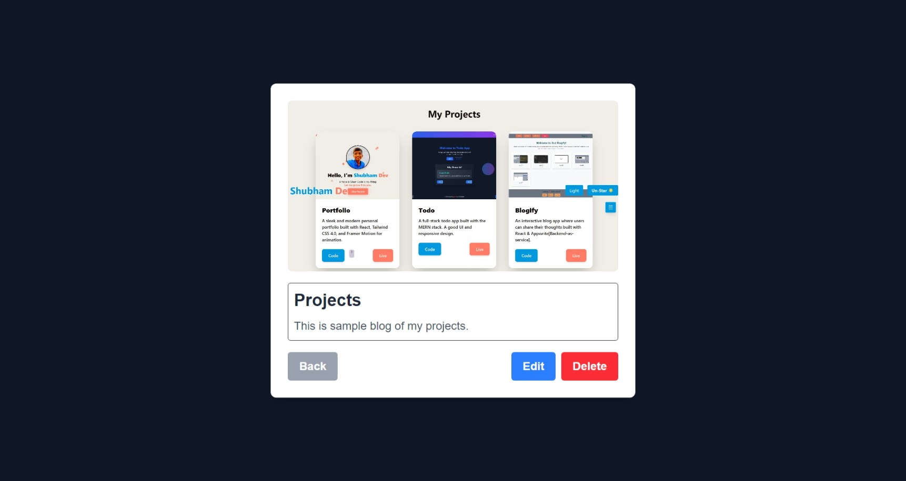

# Social Post

This is a post management application built with **React, Redux, and Tailwind CSS**.

## Features

- Create, read, update, and delete posts.
- Upload images with posts.
- Store images in local storage for faster loading.
- View post details in a popup modal.
- Responsive UI with smooth interactions.


### Home Page


### Create Post


### View Post


### Edit Post


## Installation

1. Clone the repository:
   ```sh
   git clone https://github.com/GuptaShubham-11/SocialPost.git
   cd SocialPost
   ```

2. Install dependencies:
   ```sh
   npm install
   ```

3. Run the app:
   ```sh
   npm start
   ```

## Tech Stack

- **Frontend:** React.js, Tailwind CSS
- **State Management:** Redux Toolkit

## Portfolio

- [Portfolio](https://guptashubham-11.vercel.app)